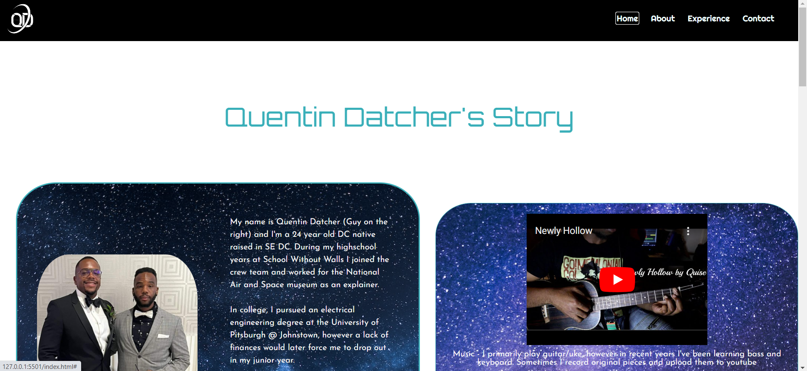
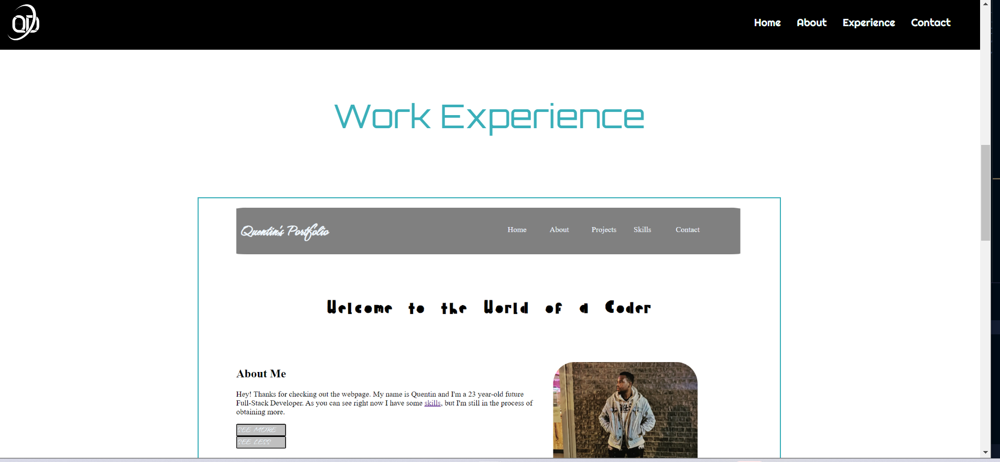
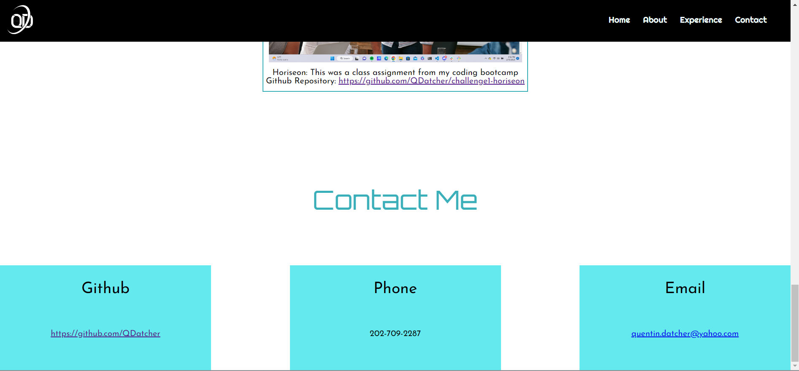

# Quentin's Portfolio

## Description

Provide a short description explaining the what, why, and how of your project. Use the following questions as a guide:

- Proffesional portfolio for ascertaining a job as a junior dev showcasing skills in effectively using html and css

## Table of Contents (Optional)

If your README is long, add a table of contents to make it easy for users to find what they need.

- [Installation](#installation)
- [Usage](#usage)
- [Credits](#credits)
- [License](#license)

## Installation

N/A

## Usage

-At the top is the header that is fixed. The left side has a logo while the right side has a navigation bar for easy navigation throughout the website.
-Below is the about me section that on then left side has a pic and description of the site creator. The right side showcases 2 videos of the site creators hobbies.

-This showcases 4 photos that display previous web projects. Clicking on the photos will send the user to the live website of the project. Underneath is a brief description of the project as well as a link to its github repo.

-The footer is a contact section that displays link to email the creator, a link to his github, and his phone number.

## Credits
N/A

## License

The last section of a high-quality README file is the license. This lets other developers know what they can and cannot do with your project. If you need help choosing a license, refer to [https://choosealicense.com/](https://choosealicense.com/).

---

🏆 The previous sections are the bare minimum, and your project will ultimately determine the content of this document. You might also want to consider adding the following sections.

## Badges

N/A

## Features

-About Me Section
-Work Experience Section
-Contact Section

## How to Contribute

N/A

## Tests

N/A